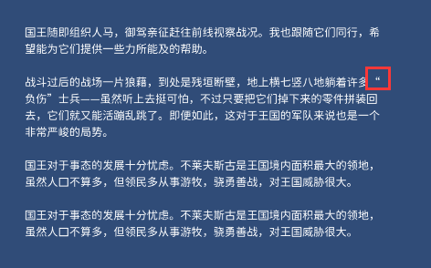

# TextBreaking
解决UGUI Text组件中文符号句首句尾问题

经常在游戏开发中碰到中文符号在句首或句尾导致显示不正常的问题，而TextMeshPro就没有这些问题因为TMP支持配置，那对于项目中没法使用TMP的情况，而用的UGUI的Text的情况，怎么办呢？

比如下图：双引号单独在句尾了，这样显示特别不美观，而版署那边又要求修改。

 

解决后：

  

还有这种，句号在句首了，也很奇怪。

 

百度谷歌也没找到合适的方案，或找到的方案有瑕疵，因此特地写了一个类，专门解决这种情况，支持配置避免行尾出现的符号、避免行首出现的符号等等，可直接拿去使用。

### 如何配置符号，可以在代码中修改此处：

 

## 实现原理

对于实现的原理，其实很暴力，就是遍历每一行，一个字一个字测试是否超过，判断其是否在行尾或行首，手动增加换行符让显示正常。
